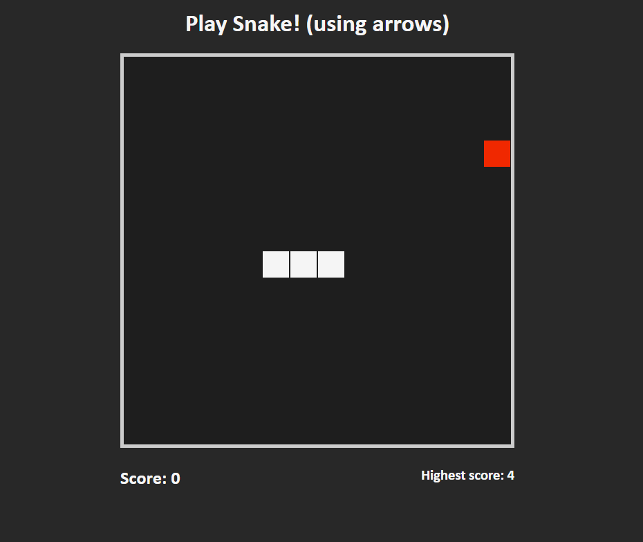

# Title: Snake Game
# Website [LINK](https://antoniobaciu.github.io/moving-blocks/)

# Short introduction:
__Snake__ is a simple game where the character must 'eat' as many __red squares__ whithout dying.
You character is 3 sqares long, and will get 1 square longer for each red square catched.

# The Game Rules:
* Eating one red square increases your length.
* If you touch the walls you die.
* If you eat a square from your body, you die.

__Features:__

- [x] Score counter
- [x] Highest score counter
